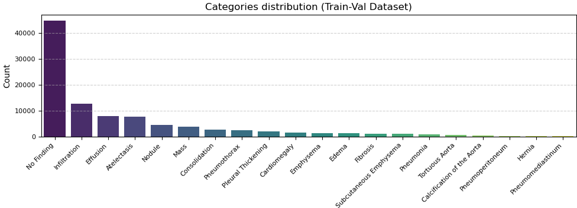
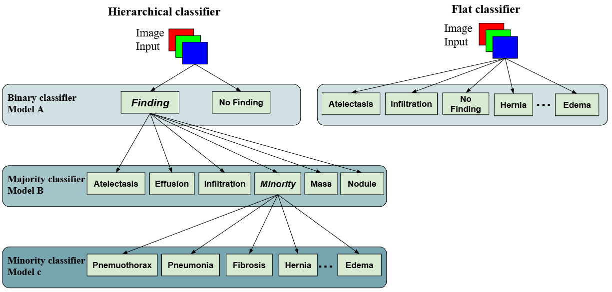

# ChestXpert: Flat vs. Hierarchical Medical Image Classification Using PreTrained Model ResNet on Chest X-ray 8 to Address Imbalanced Dataset

## Dataset:
Models in the project are trained, validated, and tested on Chest X-ray 8 [Chest X-ray 8](https://paperswithcode.com/dataset/chestx-ray8)

## To run the project you need to install the needed libraries.
After that, to download images run python file `batch_downloaded_zips.py`.

When images have been downloaded, there are two notebooks that must be run:
1. **ImageExtractor**: This notebook moves images to `data/train_images` and `data/test_images` folders based on their existence in `data/train_val_list.txt` and `data/test_list.txt` provided with the dataset.
2. **image_oversampler**: This notebook oversamples rarely represented labels, saves the augmented images in `data/oversampled_train`, and creates and saves an `augmented_images.csv` file in the `data/data_entries` folder. This CSV contains the ID of the image with its corresponding labels.

## Project Structure:
### `data/`
- Contains both images divided into 3 subfolders: `train_images`, `test_images`, and `oversampled_train`.
- Contains CSV files for image IDs with their corresponding labels divided into `train`, `validate`, and `test`. Additionally, it contains the CSV file created in `image_oversampler` as mentioned earlier.

### `flat_classifier/`
Contains 4 notebooks, where all files work with multi-label classifications with different handling of imbalance techniques. Each file uses the techniques implemented in the files above it:
1. **singular_basic**: No techniques implemented.
2. **singular_weighted_classes**: `pos_weight` added to the `BCEWithLogitsLoss`.
3. **singular_down_sampled**: Downsamples 4 dominating labels:
   - 'Infiltration',
   - 'Effusion',
   - 'Atelectasis',
   - 'No Finding'
4. **singular_over_down_sampled**: This combines augmented data with the original one in the training phase.

### `hierarchical_classifier/`
- **model_a.ipynb**: Binary classification to classify if an image contains categories or not.
- **model_b.ipynb**: Classifies and specializes in majority classes, with one extra label, 'minority', where all rarely represented classes are grouped.
- **model_c.ipynb**: Specializes in rarely represented classes.

**ChestXrayDatset.py**: Pairs image with its label(s) and returns them with the image ID. It is used to create datasets in all models except the ones that utilize oversampled images.

**MultiSourceChestXrayDataset.py**: Does the same job as the previous file, but it navigates and fetches images from original and oversampled folders based on the `is_augmented` column that tells the class whether the image is original or not.

## Flat vs. Hierarchical Architecture:
